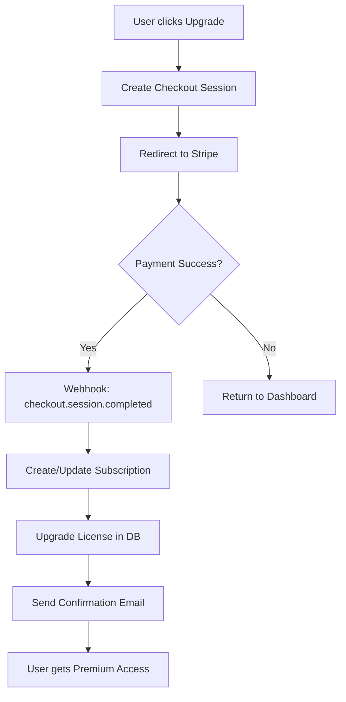

# CYBERCAT Licensing System

Complete guide to CYBERCAT's licensing, authentication, and payment system.

## 📋 Table of Contents

1. [Overview](#overview)
2. [Architecture](#architecture)
3. [Setup Instructions](#setup-instructions)
4. [Pricing Tiers](#pricing-tiers)
5. [API Documentation](#api-documentation)
6. [User Flow](#user-flow)
7. [Stripe Integration](#stripe-integration)
8. [Security Features](#security-features)

## 🎯 Overview

CYBERCAT uses a comprehensive licensing system with three tiers:
- **Free Tier**: Basic security features with daily limits
- **Pro Tier**: Full AI-powered features with unlimited usage
- **Enterprise Tier**: All features plus priority support and custom integrations

## 🏗️ Architecture

### Components

```
cybercat/
├── stripe-mcp/              # Stripe payment processing MCP server
│   ├── index.js
│   ├── package.json
│   └── .env.example
├── src/
│   ├── auth/                # Authentication system
│   │   └── auth-service.ts  # JWT-based auth with bcrypt
│   ├── license/             # License management
│   │   └── license-service.ts
│   ├── database/            # SQLite database
│   │   └── database.ts
│   ├── middleware/          # Auth & feature gating
│   │   └── auth-middleware.ts
│   └── routes/              # API endpoints
│       └── license-routes.ts
└── public/
    ├── auth.html            # Login/Signup page
    └── license-dashboard.html  # User dashboard
```

### Database Schema

**users table:**
- id (PRIMARY KEY)
- email (UNIQUE)
- password (bcrypt hashed)
- name
- stripe_customer_id
- created_at

**licenses table:**
- id (PRIMARY KEY)
- user_id (FOREIGN KEY)
- license_key (UNIQUE)
- tier (free/pro/enterprise)
- status (active/inactive/expired/cancelled)
- stripe_subscription_id
- expires_at
- created_at
- updated_at

**scan_history table:**
- id (PRIMARY KEY)
- user_id (FOREIGN KEY)
- scan_type
- target
- results
- created_at

**password_reset_tokens table:**
- id (PRIMARY KEY)
- user_id (FOREIGN KEY)
- token
- expires_at
- created_at

## 🚀 Setup Instructions

### 1. Install Dependencies

```bash
cd james-ultimate
npm install
```

Required packages:
- `jsonwebtoken` - JWT token generation
- `bcryptjs` - Password hashing
- `sqlite3` - Database
- `stripe` - Payment processing

### 2. Configure Environment Variables

Create `.env` file in `james-ultimate/`:

```env
# JWT Secrets (generate with: node -e "console.log(require('crypto').randomBytes(32).toString('hex'))")
JWT_SECRET=your_jwt_secret_here
JWT_REFRESH_SECRET=your_jwt_refresh_secret_here

# Stripe API Keys (get from https://dashboard.stripe.com/apikeys)
STRIPE_SECRET_KEY=sk_test_your_stripe_secret_key
STRIPE_PUBLISHABLE_KEY=pk_test_your_stripe_publishable_key

# Admin Emails (comma-separated)
ADMIN_EMAILS=admin@cybercat.com,support@cybercat.com

# Server Configuration
PORT=3000
HOST=0.0.0.0
```

### 3. Set Up Stripe MCP Server

```bash
cd stripe-mcp
npm install
cp .env.example .env
# Edit .env with your Stripe keys
```

### 4. Create Stripe Products

Use Stripe Dashboard or API to create:

**Pro Tier:**
- Product: "CYBERCAT Pro"
- Price: $29/month recurring
- Save the Price ID

**Enterprise Tier:**
- Product: "CYBERCAT Enterprise"
- Price: $99/month recurring
- Save the Price ID

Update `.env` with Price IDs:
```env
STRIPE_PRO_PRICE_ID=price_xxxxx
STRIPE_ENTERPRISE_PRICE_ID=price_xxxxx
```

### 5. Start the Server

```bash
npm run dev:server
```

The server will:
1. Initialize SQLite database
2. Create required tables
3. Start on http://localhost:3000

## 💰 Pricing Tiers

### Free Tier ($0/month)

**Features:**
- Basic port scanning
- System information gathering
- Simple vulnerability checks

**Limitations:**
- 1 scan per day
- No AI threat analysis
- No export capabilities

### Pro Tier ($29/month)

**Features:**
- All Free features
- AI-powered threat analysis
- Multi-LLM access (OpenAI, Claude, Ollama, etc.)
- Unlimited scans
- Real-time monitoring
- IoT device management
- Custom security agents
- Export reports

**Best for:** Security professionals and small teams

### Enterprise Tier ($99/month)

**Features:**
- All Pro features
- Priority support
- Custom integrations
- Advanced analytics
- Team collaboration
- Dedicated account manager

**Best for:** Organizations and large teams

## 📡 API Documentation

### Authentication Endpoints

#### Register
```http
POST /api/auth/register
Content-Type: application/json

{
  "email": "user@example.com",
  "password": "securePassword123",
  "name": "John Doe"
}
```

Response:
```json
{
  "success": true,
  "user": {
    "id": 1,
    "email": "user@example.com",
    "name": "John Doe",
    "license_tier": "free",
    "license_key": "CC-XXXX-XXXX-XXXX-XXXX"
  },
  "tokens": {
    "accessToken": "eyJhbGc...",
    "refreshToken": "eyJhbGc..."
  }
}
```

#### Login
```http
POST /api/auth/login
Content-Type: application/json

{
  "email": "user@example.com",
  "password": "securePassword123"
}
```

#### Get Profile
```http
GET /api/auth/profile
Authorization: Bearer {accessToken}
```

#### Refresh Token
```http
POST /api/auth/refresh
Content-Type: application/json

{
  "refreshToken": "eyJhbGc..."
}
```

### License Endpoints

#### Validate License
```http
GET /api/license/validate?key=CC-XXXX-XXXX-XXXX-XXXX
```

#### Get License Details
```http
GET /api/license/details
Authorization: Bearer {accessToken}
```

#### Check Feature Access
```http
POST /api/license/check-feature
Authorization: Bearer {accessToken}
Content-Type: application/json

{
  "feature": "ai_threat_analysis"
}
```

#### Upgrade License
```http
POST /api/license/upgrade
Authorization: Bearer {accessToken}
Content-Type: application/json

{
  "tier": "pro",
  "subscriptionId": "sub_xxxxx",
  "expiresAt": "2025-01-19T00:00:00.000Z"
}
```

### Scan Endpoints

#### Check Scan Limit
```http
POST /api/scan/check-limit
Authorization: Bearer {accessToken}
```

#### Get Scan Statistics
```http
GET /api/scan/statistics
Authorization: Bearer {accessToken}
```

#### Get Scan History
```http
GET /api/scan/history?limit=50
Authorization: Bearer {accessToken}
```

### Pricing Endpoint

#### Get Pricing Tiers
```http
GET /api/pricing
```

## 👤 User Flow

### New User Registration

1. User visits `/auth.html`
2. Fills signup form
3. System creates:
   - User account (password hashed with bcrypt)
   - Free tier license
   - JWT access & refresh tokens
4. Redirects to `/license-dashboard.html`

### Existing User Login

1. User visits `/auth.html`
2. Enters credentials
3. System validates and generates tokens
4. Redirects to dashboard

### License Upgrade

1. User clicks "Upgrade" button
2. Redirected to Stripe Checkout
3. After payment:
   - Stripe webhook notifies server
   - License upgraded in database
   - User gains access to premium features

### Feature Access Control

When user attempts to use a premium feature:

1. Middleware checks JWT token
2. Validates license tier
3. Checks if feature is available in user's tier
4. If not available:
   - Returns 403 Forbidden
   - Suggests upgrade
5. If available:
   - Allows access
   - Records usage

### Daily Scan Limits

Free tier users:
1. Each scan increments daily counter
2. Counter resets at midnight
3. After 1 scan, returns 429 error
4. Suggests upgrade to Pro

## 💳 Stripe Integration

### Setup Webhook

1. Go to Stripe Dashboard > Developers > Webhooks
2. Add endpoint: `https://your-domain.com/api/stripe/webhook`
3. Select events:
   - `checkout.session.completed`
   - `customer.subscription.created`
   - `customer.subscription.updated`
   - `customer.subscription.deleted`
   - `invoice.payment_succeeded`
   - `invoice.payment_failed`

4. Copy webhook secret to `.env`:
```env
STRIPE_WEBHOOK_SECRET=whsec_xxxxx
```

### Payment Flow



### Subscription Management

**Create Subscription:**
```javascript
const session = await stripe.checkout.sessions.create({
  mode: 'subscription',
  line_items: [{
    price: 'price_xxxxx',
    quantity: 1
  }],
  success_url: 'https://your-domain.com/success',
  cancel_url: 'https://your-domain.com/cancel'
});
```

**Cancel Subscription:**
```javascript
await stripe.subscriptions.cancel(subscriptionId);
```

## 🔒 Security Features

### Password Security
- Passwords hashed with bcrypt (10 rounds)
- Minimum 8 characters required
- Never stored in plain text

### JWT Tokens
- Access token expires in 1 hour
- Refresh token expires in 7 days
- Signed with HS256 algorithm
- Secret keys stored in environment variables

### API Key Storage
- API keys encrypted with AES-256-GCM
- Master key derived from JWT_SECRET
- Stored encrypted in database

### Rate Limiting
- 200 requests per minute per IP
- Configurable per endpoint
- Automatic IP blacklisting on abuse

### Input Validation
- All inputs sanitized
- SQL injection prevention
- XSS protection
- CSRF tokens on forms

### Audit Logging
- All authentication attempts logged
- License changes tracked
- Suspicious activity flagged

## 🎨 Feature Gating

### In Code

```typescript
import { authMiddleware } from './middleware/auth-middleware';

// Require authentication
app.get('/api/protected', authMiddleware.authenticate, handler);

// Require specific tier
app.get('/api/premium', authMiddleware.requireTier('pro'), handler);

// Require specific feature
app.post('/api/scan/advanced',
  authMiddleware.requireFeature('ai_threat_analysis'),
  handler
);

// Check scan limit
app.post('/api/scan',
  authMiddleware.checkScanLimit,
  handler
);
```

### Feature List

**Free Tier:**
- `basic_port_scan`
- `system_info`
- `simple_vuln_check`

**Pro Tier (includes Free):**
- `ai_threat_analysis`
- `multi_llm_access`
- `unlimited_scans`
- `real_time_monitoring`
- `iot_management`
- `custom_agents`
- `export_reports`

**Enterprise Tier (includes Pro):**
- `priority_support`
- `custom_integrations`
- `advanced_analytics`
- `team_collaboration`

## 📊 Monitoring & Analytics

### Track User Activity

```typescript
// Record scan
await licenseService.recordScan(
  userId,
  'port_scan',
  '192.168.1.1',
  JSON.stringify(results)
);

// Get statistics
const stats = await licenseService.getScanStatistics(userId);
```

### Database Queries

```sql
-- Active subscriptions
SELECT COUNT(*) FROM licenses WHERE status = 'active' AND tier != 'free';

-- Revenue by tier
SELECT tier, COUNT(*) * CASE 
  WHEN tier = 'pro' THEN 29 
  WHEN tier = 'enterprise' THEN 99 
END as monthly_revenue
FROM licenses 
WHERE status = 'active'
GROUP BY tier;

-- Daily active users
SELECT DATE(created_at) as date, COUNT(*) 
FROM scan_history 
GROUP BY DATE(created_at);
```

## 🐛 Troubleshooting

### Database Issues

**Error: SQLITE_CANTOPEN**
```bash
# Check file permissions
chmod 644 cybercat.db

# Or delete and reinitialize
rm cybercat.db
npm run dev:server
```

### Token Issues

**Error: Invalid token**
- Check JWT_SECRET is set correctly
- Tokens expire - use refresh token
- Clear browser localStorage and re-login

### Stripe Issues

**Error: Invalid API key**
- Verify STRIPE_SECRET_KEY in .env
- Check you're using correct mode (test/live)
- Regenerate keys in Stripe Dashboard

### License Validation

**Error: License not found**
- User may not have been properly registered
- Check database for user entry
- Regenerate license if needed

## 📝 License Key Format

Format: `CC-XXXX-XXXX-XXXX-XXXX`

- Prefix: `CC-` (CYBERCAT)
- 4 segments of 4 hexadecimal characters
- Generated using crypto.randomBytes
- Stored in database with user association

Example: `CC-A3F2-B8C1-9D4E-7F65`

## 🔄 Backup & Recovery

### Database Backup

```typescript
import { Database } from './database/database';

const db = new Database();
await db.backup('./backups/cybercat-backup.db');
```

### Restore Database

```bash
cp ./backups/cybercat-backup.db ./cybercat.db
npm run dev:server
```

## 📞 Support

For licensing issues:
- Email: licensing@cybercat.com
- Documentation: https://docs.cybercat.com
- Status: https://status.cybercat.com

## 🚀 Production Deployment

### Environment Setup

1. Use production Stripe keys
2. Set secure JWT secrets (32+ characters)
3. Enable HTTPS
4. Configure proper CORS origins
5. Set up database backups
6. Configure webhook endpoints
7. Enable monitoring & logging

### Security Checklist

- [ ] Strong JWT secrets set
- [ ] Database encrypted at rest
- [ ] HTTPS enabled
- [ ] Rate limiting configured
- [ ] API keys encrypted
- [ ] Webhook signatures verified
- [ ] Input validation active
- [ ] Audit logging enabled
- [ ] Backup strategy in place
- [ ] Monitoring configured

## 📄 License

This licensing system is proprietary to CYBERCAT.
Copyright © 2025 Emersa Ltd. All Rights Reserved.